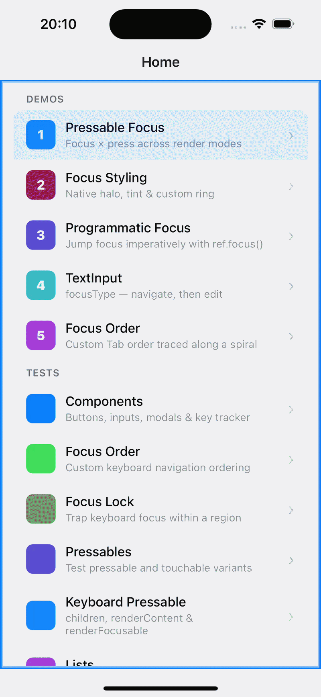
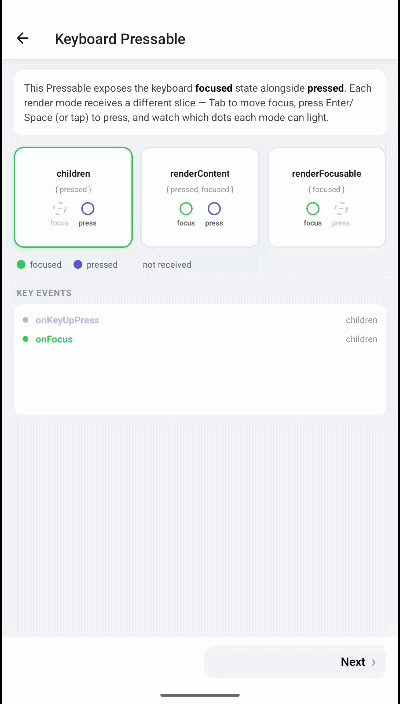

# Getting Started

| iOS | Android |
| --- | --- |
|  |  |

`react-native-external-keyboard` adds physical (external) keyboard support to React Native apps: keyboard focus management, key-press events, custom focus order, and focus locking — on both iOS and Android.

## Requirements

- React Native 0.71 or later
- iOS 13+ / Android API 21+
- Expo SDK 49+ (bare workflow / prebuild)

## Architecture support

| Architecture | Supported |
| :-- | :-- |
| New Architecture (Fabric / Turbo Modules) | Yes |
| Old Architecture (Bridge) | Yes |
| Bridgeless mode | Yes |

## Installation

```sh
npm install react-native-external-keyboard
```

```sh
yarn add react-native-external-keyboard
```

### iOS

Run pod install after adding the package:

```sh
cd ios && pod install && cd ..
```

### Expo

Compatible with Expo prebuild — no config plugin is required. The library uses native code, so it does **not** run in Expo Go:

```sh
npx expo prebuild
```

## Quick start

The quickest way in is the **`K` namespace** — ready-made, keyboard-focusable versions of the React Native primitives you already use. No wrapping, no setup:

| `K.*` | Replaces | Use for |
| :-- | :-- | :-- |
| `K.Pressable` | `Pressable` | Buttons and tappable rows |
| `K.View` | `View` | Focus containers, key handling, grouping |
| `K.Input` | `TextInput` | Text fields |

```tsx
import { K } from 'react-native-external-keyboard';
import { Text } from 'react-native';

export default function App() {
  return (
    <K.Pressable
      autoFocus
      onPress={() => console.log('activated')}
      focusStyle={{ backgroundColor: 'dodgerblue' }}
      onFocus={() => console.log('focused')}
      onBlur={() => console.log('blurred')}
    >
      <Text>Press me with Space or Enter</Text>
    </K.Pressable>
  );
}
```

On a hardware keyboard, move focus with `Tab` / `Shift + Tab`, and activate with `Space` or `Enter`.

> [!NOTE]
> On iOS, long-pressing the spacebar does **not** fire a long press — iOS routes that through *Full Keyboard Access*. Use `Tab + M` (the default "open context menu" command) instead. You can remap it in **Full Keyboard Access → Commands**.

### Wrapping your own components

When you need focus on a component the `K` namespace doesn't cover — `TouchableOpacity`, a custom button, a third-party component — wrap it with the `withKeyboardFocus` HOC. It adds the same focus/blur events, focus styling, `autoFocus`, and imperative focus ref to any `Pressable`/`Touchable`-like component:

```tsx
import { withKeyboardFocus } from 'react-native-external-keyboard';
import { TouchableOpacity } from 'react-native';

const KeyboardTouchable = withKeyboardFocus(TouchableOpacity);
```

See [Pressable focus handling](../guides/pressable-focus.md) for events, styling, and render props.

> [!NOTE]
> `K.Pressable` is the library's pre-wrapped `Pressable`. On React Native 0.83+ its bundled types can clash with your local RN types — if you hit a TypeScript error, wrap RN's own `Pressable` with `withKeyboardFocus` instead. See the [migration note](../migration/migration.md#migrating-to-080-from-07x).

## What's available

| Export | Purpose |
| :-- | :-- |
| [`withKeyboardFocus(Component)`](../components/overview.md#withkeyboardfocus) | HOC that adds keyboard focus to any `Pressable`/`Touchable`-like component |
| [`KeyboardExtendedView`](../components/overview.md#keyboardextendedview) | Focus-aware `View` for key handling and grouping |
| [`KeyboardExtendedInput`](../components/overview.md#keyboardextendedinput) | `TextInput` with keyboard focus support |
| [`KeyboardExtendedBaseView`](../components/overview.md#keyboardextendedbaseview) | Low-level focusable view (alias `ExternalKeyboardView`) |
| [`KeyboardFocusGroup`](../components/overview.md#keyboardfocusgroup) | iOS `focusGroupIdentifier` grouping + global `tintColor` |
| [`Focus.Frame` / `Focus.Trap`](../components/overview.md#focusframe--focustrap) | Confine focus to a region (modals, overlays) |
| [`KeyboardOrderFocusGroup`](../components/overview.md#keyboardorderfocusgroup) | Namespacing + index-based focus ordering |
| [`Keyboard`](../api/overview.md#keyboard-module) | Dismiss the soft keyboard from a hardware keyboard |

## Built-in aliases

The same components are exported under several names for convenience and backward compatibility:

| Canonical | Aliases |
| :-- | :-- |
| `BaseKeyboardView` | `ExternalKeyboardView`, `KeyboardExtendedBaseView` |
| `KeyboardFocusView` | `KeyboardExtendedView`, `K.View` |
| `KeyboardExtendedInput` | `TextInput`, `K.Input` |
| `Pressable` | `KeyboardExtendedPressable`, `K.Pressable` |

---

**Next:** [Pressable focus handling →](../guides/pressable-focus.md) — learn the everyday workflow.

**Reference:** [Component overview →](../components/overview.md) — the full props tables.
