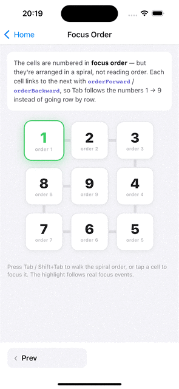
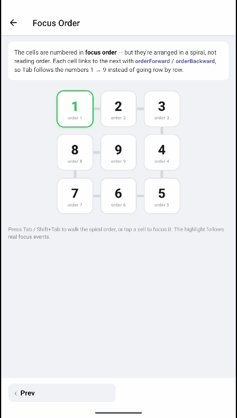

# Focus order

| iOS | Android |
| --- | --- |
|  |  |

By default, physical-keyboard focus follows the native view hierarchy. When your visual layout differs from that order — grids, columns, custom navigation — you can take control with three independent systems that can be combined:

1. **[Link-based](#1-link-based-ordering)** — each element names which element to focus next in each direction.
2. **[Index-based](#2-index-based-ordering)** — elements in a named group are focused in ascending index order.
3. **[Direction locking](#3-direction-locking)** — block focus movement in specific directions.

All of these props are available on every focusable component (`withKeyboardFocus`-wrapped components, `KeyboardExtendedView`, `KeyboardExtendedInput`, `KeyboardExtendedBaseView`).

---

## 1. Link-based ordering

The most explicit approach: give an element an `orderId`, then point each directional prop at the `orderId` of the element that should receive focus when moving that way.

```tsx
<View>
  <Pressable orderId="a" orderForward="b" onPress={onPress}>
    <Text>1</Text>
  </Pressable>
  <Pressable orderId="b" orderBackward="a" orderForward="c" onPress={onPress}>
    <Text>2</Text>
  </Pressable>
  <Pressable orderId="c" orderBackward="b" onPress={onPress}>
    <Text>3</Text>
  </Pressable>
</View>
```

| Prop | Direction |
| :-- | :-- |
| `orderForward` | `Tab` |
| `orderBackward` | `Shift + Tab` |
| `orderLeft` / `orderRight` | Arrow / DPad horizontal |
| `orderUp` / `orderDown` | Arrow / DPad vertical |
| `orderFirst` / `orderLast` | *(iOS)* jump to first / last. `null` clears the link. |

This makes link-based ordering ideal for both linear (`Tab`) flows and 2-D directional (DPad / arrow) navigation.

### ⚠️ `orderId` values are global

`orderId`s share one global namespace. If the same component renders more than once — a list row, a repeated card — duplicate `orderId`s collide and cause focus to jump to the wrong element. Using a link prop with no namespace also logs a dev warning.

There are two ways to keep IDs unique.

#### Auto-namespace with `KeyboardOrderFocusGroup`

Wrap repeated content; every `orderId` inside gets an automatic, isolated namespace. Best when you just need uniqueness and don't care about the exact prefix:

```tsx
import { KeyboardOrderFocusGroup } from 'react-native-external-keyboard';

{items.map((item) => (
  <KeyboardOrderFocusGroup key={item.id}>
    <Pressable orderId="title" orderForward="action" onPress={onPress}>…</Pressable>
    <Pressable orderId="action" orderBackward="title" onPress={onPress}>…</Pressable>
  </KeyboardOrderFocusGroup>
))}
```

#### Static namespace with `groupId` / `orderPrefix`

Use an explicit string when you need a stable, predictable prefix — for example to link two sibling components that know about each other:

```tsx
// groupId on the wrapper
<KeyboardOrderFocusGroup groupId="card_42">
  <Pressable orderId="title" orderForward="action" onPress={onPress}>…</Pressable>
  <Pressable orderId="action" orderBackward="title" onPress={onPress}>…</Pressable>
</KeyboardOrderFocusGroup>

// or orderPrefix directly on each component
<Pressable orderPrefix="card_42" orderId="title" orderForward="action" onPress={onPress}>…</Pressable>
<Pressable orderPrefix="card_42" orderId="action" orderBackward="title" onPress={onPress}>…</Pressable>
```

The prefix is prepended to this element's `orderId` **and** all of its `order*` targets, so links inside the same namespace keep working unchanged.

---

## 2. Index-based ordering

When you just need a sequence within a container, index-based ordering is less verbose than linking. Elements that declare `orderIndex` inside a named group are focused in ascending index order — regardless of their position in the tree.

```tsx
import { KeyboardOrderFocusGroup } from 'react-native-external-keyboard';

<KeyboardOrderFocusGroup>
  <View>
    <Pressable orderIndex={0} onPress={onPress}><Text>First</Text></Pressable>
    <Pressable orderIndex={2} onPress={onPress}><Text>Third</Text></Pressable>
    <Pressable orderIndex={1} onPress={onPress}><Text>Second</Text></Pressable>
  </View>
</KeyboardOrderFocusGroup>
```

| Prop | Type | Description |
| :-- | :-- | :-- |
| `orderGroup` | `string` | Name of the group. Provided automatically by `KeyboardOrderFocusGroup`. |
| `orderIndex` | `number` | Position within the group; lower is focused first. |

`KeyboardOrderFocusGroup` provides the group via context, so children only need `orderIndex`. Alternatively, set `orderGroup` directly on each element to skip the wrapper:

```tsx
<Pressable orderGroup="main" orderIndex={0} onPress={onPress}><Text>First</Text></Pressable>
<Pressable orderGroup="main" orderIndex={1} onPress={onPress}><Text>Second</Text></Pressable>
```

> [!NOTE]
> `orderIndex` must have a group. Declare it inside a `KeyboardOrderFocusGroup` or pass `orderGroup` — otherwise a dev warning is logged and ordering won't apply.

### `KeyboardOrderFocusGroup` props

| Prop | Type | Description |
| :-- | :-- | :-- |
| `groupId` | `string` | Explicit group name. Auto-generated when omitted. |
| `children` | `ReactNode` | Child components. |

---

## 3. Direction locking

`lockFocus` blocks focus from moving out of an element in the given directions. Useful for keeping focus within a region or preventing accidental escapes.

```tsx
<Pressable lockFocus={['down', 'right']} onPress={onPress}>
  <Text>Can't move down or right from here</Text>
</Pressable>
```

| Value | Blocks |
| :-- | :-- |
| `'up'` / `'down'` / `'left'` / `'right'` | Directional (arrow / DPad) movement |
| `'forward'` / `'backward'` | `Tab` / `Shift + Tab` |
| `'first'` / `'last'` | *(iOS)* jumping to the first / last focusable element |

> [!NOTE]
> `first` and `last` are iOS-specific. When `forward` / `backward` are blocked on iOS, the system tries to focus the `first` / `last` element — locking those too fully contains focus.

---

## Combining systems

The three systems are independent and can be mixed. A common pattern is index-based ordering for the overall sequence plus `lockFocus` to keep focus contained, or link-based ordering with `orderPrefix` for repeated cards. Pick the simplest system that expresses the intent:

| Need | Use |
| :-- | :-- |
| A simple linear or directional sequence | Link-based (`orderForward` / arrows) |
| Reorder a set of siblings by number | Index-based (`orderIndex` + group) |
| Repeated components (lists, cards) | Either system + `KeyboardOrderFocusGroup` / `orderPrefix` |
| Trap focus in a region | `lockFocus` (and see [Focus.Trap](../components/overview.md#focusframe--focustrap)) |

---

## Related

- [API reference → Focus-order props](../api/overview.md#focus-order-props)
- [Component overview → KeyboardOrderFocusGroup](../components/overview.md#keyboardorderfocusgroup)

---

← [Keyboard text input](./text-input.md) · [Component overview →](../components/overview.md)
