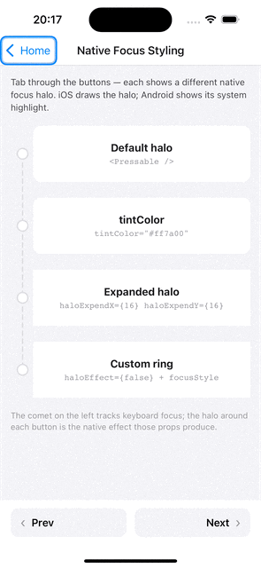
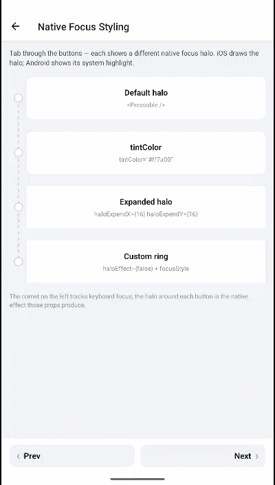

# Native focus styling — halo, tint & Android highlight

| iOS | Android |
| --- | --- |
|  |  |

Beyond your own `style`/`focusStyle` ([see Pressable focus handling](./pressable-focus.md)), each platform draws a **native** focus indicator. This guide covers configuring and disabling it: the iOS halo (`haloEffect`, `tintColor`, `haloExpendX`/`haloExpendY`, `haloCornerRadius`) and the Android highlight (`defaultFocusHighlightEnabled`).

| Platform | Native indicator | Controlled by |
| :-- | :-- | :-- |
| iOS | The focus **halo** (a ring drawn around the focused view) | `haloEffect`, `tintColor`, `halo*` props |
| Android | The system **focus highlight** | `defaultFocusHighlightEnabled` |
| Both | Cross-platform shortcut to turn the native indicator **off** | `tintType="none"` |

Both are **enabled by default**. The iOS halo props have no effect on Android, and `defaultFocusHighlightEnabled` has no effect on iOS. To switch the native indicator off on **both** platforms with one prop, use [`tintType="none"`](#turning-off-all-native-indicators).

---

## iOS — the halo effect

On iOS the focused view gets a halo ring (`UIFocusHaloEffect`). It is on by default.

```tsx
<KeyboardPressable haloEffect tintColor="dodgerblue" onPress={onPress}>
  <Text>Halo on focus</Text>
</KeyboardPressable>
```

| Prop | Type | Default | Description |
| :-- | :-- | :-- | :-- |
| `haloEffect` | `boolean` | `true` | Draw the halo ring on focus. |
| `tintColor` | `string` | — | Color of the halo / focus tint. |
| `haloCornerRadius` | `number` | `0` | Corner radius of the halo ring, in points. |
| `haloExpendX` | `number` | `0` | Horizontal expansion of the ring beyond the view bounds, in points. |
| `haloExpendY` | `number` | `0` | Vertical expansion of the ring beyond the view bounds, in points. |

### Shaping the halo

`haloExpendX` / `haloExpendY` push the ring outward so it doesn't hug the content too tightly, and `haloCornerRadius` rounds it to match a rounded button:

```tsx
<KeyboardPressable
  haloEffect
  tintColor="dodgerblue"
  haloExpendX={6}
  haloExpendY={6}
  haloCornerRadius={12}
  style={styles.roundedButton}
  onPress={onPress}
>
  <Text>Rounded, padded halo</Text>
</KeyboardPressable>
```

### Disabling the iOS halo

Set `haloEffect={false}` to turn the ring off (for example, when you draw your own focus ring via `focusStyle` / `containerFocusStyle`):

```tsx
<KeyboardPressable
  haloEffect={false}
  containerFocusStyle={{ borderWidth: 2, borderColor: 'dodgerblue' }}
  onPress={onPress}
>
  <Text>Custom ring, no halo</Text>
</KeyboardPressable>
```

### `roundedHaloFix` (deprecated, no-op)

`roundedHaloFix` used to work around a UIKit + React Native interaction where a disabled halo (`haloEffect={false}`) could reappear on a view with `borderRadius` — UIKit re-armed the halo from the view's `layer.cornerRadius` on every layout pass. That is fixed at the source now: a disabled halo always resolves to a suppressed effect, so it can no longer reappear from the view's `layer.cornerRadius`. `roundedHaloFix` is kept only for backwards compatibility, has no effect, and will be removed in a future major version — remove it from your code.

The halo's shape is no longer inferred from `borderRadius` at all — `haloCornerRadius` is the only thing that rounds the **halo ring**, and you set it explicitly to match a rounded component:

```tsx
<KeyboardPressable
  haloCornerRadius={16}
  style={{ borderRadius: 16 }}
  onPress={onPress}
>
  <Text>Rounded focus highlight</Text>
</KeyboardPressable>
```

To disable the halo on a rounded view, just set `haloEffect={false}` — no extra prop needed:

```tsx
<KeyboardPressable
  haloEffect={false}
  style={{ borderRadius: 16 }}
  onPress={onPress}
>
  <Text>Rounded, no halo</Text>
</KeyboardPressable>
```

---

## Android — the default focus highlight

Android draws its own system focus highlight on the focused native view, controlled by `defaultFocusHighlightEnabled` (on by default). The iOS `haloEffect` / `tintColor` / `halo*` props do nothing on Android.

```tsx
// Disable Android's native highlight (e.g. when using your own focusStyle)
<KeyboardPressable
  defaultFocusHighlightEnabled={false}
  focusStyle={{ backgroundColor: '#e0e0e0' }}
  onPress={onPress}
>
  <Text>Custom highlight only</Text>
</KeyboardPressable>
```

| Prop | Type | Default | Description |
| :-- | :-- | :-- | :-- |
| `defaultFocusHighlightEnabled` | `boolean` | `true` | Enable Android's default focus highlight for the focused native view. |

---

## Turning off all native indicators

To rely entirely on your own `focusStyle` / `containerFocusStyle` across both platforms, disable both native indicators. The simplest way is `tintType="none"` — a cross-platform shortcut that turns the iOS halo **and** the Android highlight off in one prop:

```tsx
<KeyboardPressable
  tintType="none" // iOS halo + Android highlight, both off
  focusStyle={({ focused }) => ({
    backgroundColor: focused ? 'dodgerblue' : 'transparent',
  })}
  onPress={onPress}
>
  <Text>Fully custom focus look</Text>
</KeyboardPressable>
```

`tintType="none"` is equivalent to setting `haloEffect={false}` on iOS and `defaultFocusHighlightEnabled={false}` on Android:

```tsx
<KeyboardPressable
  haloEffect={false}                  // iOS
  defaultFocusHighlightEnabled={false} // Android
  focusStyle={({ focused }) => ({
    backgroundColor: focused ? 'dodgerblue' : 'transparent',
  })}
  onPress={onPress}
>
  <Text>Fully custom focus look</Text>
</KeyboardPressable>
```

| Prop | Type | Default | Description |
| :-- | :-- | :-- | :-- |
| `tintType` | `'default' \| 'none'` | `'default'` | `'none'` disables the native focus indicator on both platforms (iOS halo + Android highlight). `'default'` keeps it. |

> [!NOTE]
> `tintType="none"` works on `KeyboardExtendedInput` too, and — like `haloEffect={false}` — always resolves to a suppressed halo, including on rounded (`borderRadius`) views. No extra prop needed.

---

## Related

- [Pressable focus handling](./pressable-focus.md) — `focusStyle`, `containerFocusStyle`, render props
- [Component overview → common focus props](../components/overview.md#common-focus-props)

---

← [Pressable focus handling](./pressable-focus.md) · [Programmatic focus →](./programmatic-focus.md)
