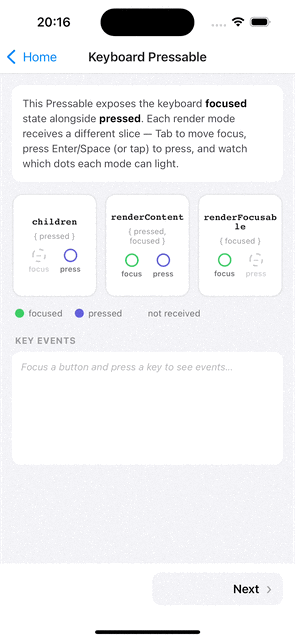
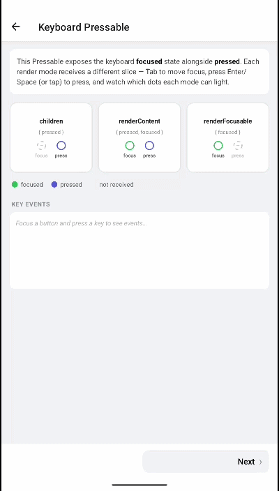

# Pressable focus handling

| iOS | Android |
| --- | --- |
|  |  |

This guide covers how a keyboard-focusable `Pressable`/`Touchable` reports focus and how to style it: the focus lifecycle events (`onFocus`, `onBlur`, `onFocusChange`), the unified `style`/`containerStyle` callback (plus the legacy `focusStyle`/`containerFocusStyle` props), the two render props (`renderContent`, `renderFocusable`), and the zero-re-render `useIsViewFocused`/`useIsViewPressed` hooks.

Everything here applies to any component created with `withKeyboardFocus` and to the ready-made `K.Pressable`.

For a plain `Pressable`, reach for `K.Pressable` — it's already wrapped, so there's nothing to set up:

```tsx
import { K } from 'react-native-external-keyboard';

// Use directly — equivalent to withKeyboardFocus(Pressable)
<K.Pressable onPress={onPress}>
  <Text>Item</Text>
</K.Pressable>
```

For your own touchables (a custom button, `TouchableOpacity`, …), wrap them with `withKeyboardFocus`:

```tsx
import { withKeyboardFocus } from 'react-native-external-keyboard';
import { Pressable, TouchableOpacity } from 'react-native';

const KeyboardPressable = withKeyboardFocus(Pressable); // same as K.Pressable
const KeyboardTouchable = withKeyboardFocus(TouchableOpacity);
```

The examples below use `KeyboardPressable`, but `K.Pressable` is interchangeable — they're the same component.

---

## Focus & blur events

A keyboard-focusable component fires events as physical-keyboard focus moves in and out of it. These are independent of press events — they fire on `Tab` / `Shift + Tab` / arrow navigation, not on activation.

| Event | Fires when | Signature |
| :-- | :-- | :-- |
| `onFocus` | The component gains keyboard focus. | `() => void` |
| `onBlur` | The component loses keyboard focus. | `() => void` |
| `onFocusChange` | On focus **and** blur. | `(isFocused: boolean, tag?: number) => void` |

```tsx
<KeyboardPressable
  onFocus={() => console.log('focused')}
  onBlur={() => console.log('blurred')}
  onFocusChange={(isFocused, tag) => console.log({ isFocused, tag })}
  onPress={onPress}
>
  <Text>Item</Text>
</KeyboardPressable>
```

`onFocusChange` is the convenient one for driving a single piece of state:

```tsx
const [focused, setFocused] = useState(false);

<KeyboardPressable onFocusChange={setFocused} onPress={onPress}>
  <Text>{focused ? 'Focused' : 'Not focused'}</Text>
</KeyboardPressable>
```

> [!NOTE]
> Focus events fire regardless of `disabled`. A `disabled` component can still be focused and reported via `onFocus` / `onBlur`; only the synthesized `onPress` is suppressed while disabled.

---

## Styling on focus & press

There are two layers you can style, each accepting either the unified `style`/`containerStyle` callback (the default) or the older, focus-only `focusStyle`/`containerFocusStyle` props (still fully supported):

| Prop | Applies to | Legacy equivalent |
| :-- | :-- | :-- |
| `style` | The **inner** component | `focusStyle` |
| `containerStyle` | The **outer** container | `containerFocusStyle` |

### Which approach should I use?

They all *work*, but differ in re-render cost and in whether they see `pressed`:

| Tier | Approach | Re-renders host on | Best for |
| :--: | :-- | :-- | :-- |
| **S** | No reactive styling at all | Never | Native halo only — no JS-visible focus/press state needed |
| **S** | Context leaf (`useIsViewFocused` + `useIsViewPressed`) | Never | Large lists/grids — the only pattern with zero host re-renders on *both* focus and press |
| **A** | Function `style` | Focus, + Android keyboard press (not touch) | **The default** for styling the pressable surface itself |
| **A** | `renderContent` / `renderFocusable` | Focus, + Android keyboard press (not touch) | Changing *content*, not just style, on focus/press |
| **B** | Function `containerStyle` | Focus, Android keyboard press, **and every touch press-in/out** | Styling the *outer* container/ring specifically |
| **D** | `focusStyle` / `containerFocusStyle` (legacy) | Focus only — no `pressed` | Simple focus-only styling from before `style`/`containerStyle` took a callback. Still fully supported, not deprecated — but `style`/`containerStyle` cover the same ground plus `pressed`, at the same re-render cost |

### The default: function `style` / `containerStyle`

Both accept a callback receiving `{ focused, pressed }` (an `InteractionState`):

```tsx
<KeyboardPressable
  style={({ focused, pressed }) => [
    styles.button,
    focused && styles.focused,
    pressed && styles.pressed,
  ]}
  onPress={onPress}
>
  <Text>Item</Text>
</KeyboardPressable>
```

`containerStyle` targets the outer container instead of the inner touchable — useful when a ring needs to sit on the wrapping element's own edge (e.g. a card whose focus ring must outline the whole card, not just an inner button):

```tsx
<KeyboardPressable
  style={styles.button}
  containerStyle={({ focused, pressed }) => [
    styles.ring,
    focused && styles.ringFocused,
    pressed && styles.ringPressed,
  ]}
  onPress={onPress}
>
  <Text>Item</Text>
</KeyboardPressable>
```

`pressed` reflects touch on both, plus physical-keyboard activation — the library auto-tracks keyboard press whenever a function `style`/`containerStyle` is present, so keyboard activation styles the same as touch with no extra config. (Android-only concern; override via `androidKeyboardPressState` if you need to. No-op on iOS, where native focus already drives `pressed`.)

> [!NOTE]
> `containerStyle` costs slightly more than `style`: RN's `Pressable` doesn't track touch state at the container layer, so the library tracks it itself as host state to give `containerStyle` a `pressed` value — meaning the host re-renders on every touch press-in/out, not just on focus + keyboard press. It's still the right, direct tool for styling the outer ring; the extra cost only matters at real scale (long lists/grids), where the [context-leaf pattern](#reacting-without-re-rendering--useisviewfocused--useisviewpressed) is the zero-cost alternative.

### Legacy: `focusStyle` / `containerFocusStyle`

The pre-unification API. A static style, or a callback receiving `{ focused }` only (no `pressed`):

```tsx
<KeyboardPressable
  style={styles.button}
  focusStyle={{ backgroundColor: 'dodgerblue' }}
  containerStyle={styles.container}
  containerFocusStyle={{ borderColor: 'dodgerblue', borderWidth: 2 }}
  onPress={onPress}
>
  <Text>Styled on focus</Text>
</KeyboardPressable>
```

```tsx
<KeyboardPressable
  focusStyle={({ focused }) => ({
    transform: [{ scale: focused ? 1.05 : 1 }],
  })}
  onPress={onPress}
>
  <Text>Scales on focus</Text>
</KeyboardPressable>
```

`focusStyle` and `containerFocusStyle` remain fully supported — they are **not** deprecated for this release. Prefer `style`/`containerStyle` in new code when you also care about `pressed`, since they cover the same styling at the same re-render cost with one less prop to remember.

---

## Render props: `renderContent` vs `renderFocusable`

When you need the `focused` flag **inside** the children (not just as a style), use a render prop. Which one depends on the wrapped component. Both cost the same as function `style` — the host re-renders on focus and (Android) on keyboard press.

### `renderContent` — components with a render-prop `children`

`Pressable` passes its own `{ pressed }` state to a `children` function. `renderContent` merges that state with `{ focused }`, so you can react to both at once:

```tsx
const KeyboardPressable = withKeyboardFocus(Pressable);

<KeyboardPressable
  onPress={onPress}
  renderContent={({ pressed, focused }) => (
    <View
      style={[
        styles.button,
        pressed && styles.pressed,
        focused && styles.focused,
      ]}
    >
      <Text>{pressed ? 'Pressed' : focused ? 'Focused' : 'Default'}</Text>
    </View>
  )}
/>
```

### `renderFocusable` — any other component

`TouchableOpacity` and most components do not expose a render-prop `children`, so `renderContent` isn't available. `renderFocusable` replaces `children` and receives only `{ focused }`:

```tsx
const KeyboardTouchable = withKeyboardFocus(TouchableOpacity);

<KeyboardTouchable
  onPress={onPress}
  renderFocusable={({ focused }) => (
    <View style={[styles.button, focused && styles.focused]}>
      <Text>{focused ? 'Focused' : 'Default'}</Text>
    </View>
  )}
/>
```

---

## Reacting without re-rendering — `useIsViewFocused` / `useIsViewPressed`

Keep the `KeyboardPressable` itself fully static, and read focus/press state from a small child via context instead. Only that child re-renders — the host, the native halo, and everything else in the tree stay untouched, on **both** focus and press, on **both** platforms:

```tsx
import { useIsViewFocused, useIsViewPressed } from 'react-native-external-keyboard';

const Label = () => {
  const focused = useIsViewFocused();
  const pressed = useIsViewPressed();
  return (
    <Text style={[styles.label, focused && styles.focused, pressed && styles.pressed]}>
      Item
    </Text>
  );
};

<KeyboardPressable style={styles.card} onPress={onPress}>
  <Label />
</KeyboardPressable>
```

This is the only pattern with **zero** host re-renders on both focus and press, unconditionally — `useIsViewPressed` is fed from the same press-in/press-out handling that drives every other press path, so it's correct without relying on any auto-enable heuristic.

**Use for:** long lists or dense grids where per-item re-render cost is measurable — not as a default for a handful of buttons. It also requires restructuring your content into a child that reads context, which is more code for a single button than just writing `style={({ focused, pressed }) => ...}`.

> [!NOTE]
> `useIsViewPressed` reflects the nearest `withKeyboardFocus`-wrapped host (`K.Pressable` or `withKeyboardFocus(X)`) — it is not available under `KeyboardExtendedView` / `K.View`, which has no press concept. `useIsViewFocused` works under both.

---

## Quick decision guide

- **Styling the pressable surface on focus/press (the common case)?** → function `style`.
- **Need to change content, not just style, on focus/press?** → `renderContent` / `renderFocusable`.
- **Styling the outer container/ring specifically?** → function `containerStyle` — the right tool for the job, slightly pricier due to touch tracking.
- **Rendering a long list/grid and profiling shows re-render cost matters?** → `useIsViewFocused` + `useIsViewPressed` (context leaf).
- **Only need focus, not press, and don't want the callback form?** → `focusStyle` / `containerFocusStyle` — still supported, just narrower.

---

## Related

- [Native focus styling](./focus-styling.md) — halo, tint, Android highlight
- [Programmatic focus](./programmatic-focus.md) — focus from a `ref`
- [Component overview → withKeyboardFocus](../components/overview.md#withkeyboardfocus) — full props table
- [API reference → Hooks](../api/overview.md#hooks) — `useIsViewFocused`, `useIsViewPressed` signatures
- [API reference → Types](../api/overview.md#types) — `InteractionState`, `FocusStyle`

---

← [Getting started](../getting-started/getting-started.md) · [Native focus styling →](./focus-styling.md)
