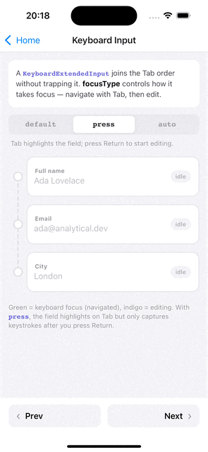
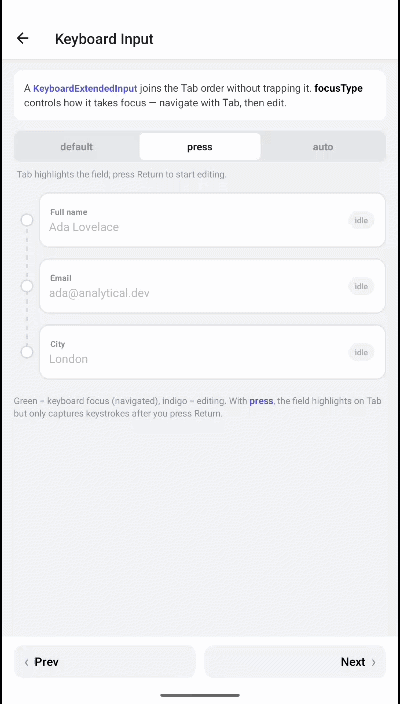

# Keyboard text input

| iOS | Android |
| --- | --- |
|  |  |

`KeyboardExtendedInput` is a `TextInput` with physical-keyboard focus support. It lets the field participate in keyboard focus navigation, customizes how it takes and releases focus across platforms, and extends `onSubmitEditing` so it works for multiline inputs too.

It is also exported as `TextInput` and `K.Input`.

```tsx
import { KeyboardExtendedInput } from 'react-native-external-keyboard';

<KeyboardExtendedInput
  value={text}
  onChangeText={setText}
  focusType="default"
  blurType="default"
/>
```

It accepts all standard `TextInputProps` plus the focus-specific props below. The exported props type is `KeyboardInputProps`.

---

## `focusType` — how the field takes keyboard focus

iOS and Android differ in how a `TextInput` reacts when keyboard focus lands on it. `focusType` lets you choose the behavior explicitly.

| Value | Behavior |
| :-- | :-- |
| `'default'` | Platform default. On Android the input is focused (editable) when keyboard focus reaches it; on iOS you press to start editing. |
| `'press'` | The input is focused for editing only after pressing **Space** while it has keyboard focus. |
| `'auto'` | The input starts editing automatically as soon as keyboard focus targets it. |

```tsx
// Editing begins as soon as Tab lands on the field
<KeyboardExtendedInput focusType="auto" value={text} onChangeText={setText} />
```

---

## `blurType` — how the field releases focus (iOS)

> **iOS only.** Defines what happens to the input when keyboard focus moves away to another component.

| Value | Behavior |
| :-- | :-- |
| `'default'` | iOS keeps the input active — you can keep typing even though keyboard focus is on another component. |
| `'disable'` | The input blurs when keyboard focus leaves it. |
| `'auto'` | Automatic blur handling. |

```tsx
<KeyboardExtendedInput blurType="disable" value={text} onChangeText={setText} />
```

---

## Multiline & submit handling

A standard multiline `TextInput` does not fire `onSubmitEditing` on Enter (Enter inserts a newline). `KeyboardExtendedInput` extends submit handling so `onSubmitEditing` works for multiline fields as well, which is useful for hardware-keyboard "send on Enter" flows.

```tsx
<KeyboardExtendedInput
  multiline
  value={message}
  onChangeText={setMessage}
  submitBehavior="blurAndSubmit"
  onSubmitEditing={(e) => send(e.nativeEvent.text)}
/>
```

| Prop | Type | Notes |
| :-- | :-- | :-- |
| `multiline` | `boolean` | Standard `TextInput` prop. Enables multiline submit handling. |
| `onSubmitEditing` | `(e: NativeSyntheticEvent<TextInputSubmitEditingEventData>) => void` | Fires on submit — including multiline, unlike a plain `TextInput`. |
| `submitBehavior` | `'submit' \| 'blurAndSubmit' \| 'newline'` | Standard `TextInput` prop. `'blurAndSubmit'` blurs the field on submit; this also drives the internal `blurOnSubmit` behavior. |

> [!NOTE]
> When `submitBehavior` is set, it governs whether the field blurs on submit (`'blurAndSubmit'` → blur). When it is omitted, the field falls back to the standard `blurOnSubmit` default (`true`).

---

## Focus styling

Like other components, the input supports per-platform native indicators and your own focus styles. See [Native focus styling](./focus-styling.md) for the full picture.

| Prop | Type | Default | Description |
| :-- | :-- | :-- | :-- |
| `focusable` | `boolean` | `true` | Whether the input can be keyboard-focused. Also controls `editable`. |
| `haloEffect` | `boolean` | `true` | *(iOS)* Halo ring on focus. |
| `roundedHaloFix` | `boolean` | `false` | *(iOS)* Keeps a disabled halo (`haloEffect={false}`) suppressed on rounded (`borderRadius`) views. [Why & alternative](./focus-styling.md#roundedhalofix). |
| `defaultFocusHighlightEnabled` | `boolean` | `true` | *(Android)* Default focus highlight. |
| `tintType` | `'default' \| 'none'` | `'default'` | Cross-platform shortcut: `'none'` disables the native focus indicator on both platforms (iOS halo + Android highlight). [Details](./focus-styling.md#turning-off-all-native-indicators). |
| `tintColor` | `string` | — | *(iOS)* Halo / tint color. |
| `style` | `StyleProp<ViewStyle>` | — | Style for the inner `TextInput`. |
| `focusStyle` | [`FocusStyle`](../api/overview.md#focusstyle) | — | Style applied to the inner input when focused. |
| `containerStyle` | `StyleProp<ViewStyle>` | — | Style for the container. |
| `containerFocusStyle` | [`FocusStyle`](../api/overview.md#focusstyle) | — | Container style when focused. |
| `onFocusChange` | `(isFocused: boolean) => void` | — | Called on focus or blur. |

```tsx
<KeyboardExtendedInput
  value={text}
  onChangeText={setText}
  tintColor="dodgerblue"
  focusStyle={{ borderColor: 'dodgerblue', borderWidth: 2 }}
  onFocusChange={(isFocused) => setActive(isFocused)}
/>
```

---

## Focus order

`KeyboardExtendedInput` participates in focus ordering just like any other component — it accepts the `orderId` / `order*`, `orderIndex` / `orderGroup`, and `lockFocus` props. See [Focus order](./focus-order.md).

---

## Related

- [Native focus styling](./focus-styling.md)
- [Focus order](./focus-order.md)
- [Component overview → KeyboardExtendedInput](../components/overview.md#keyboardextendedinput)

---

← [Programmatic focus](./programmatic-focus.md) · [Focus order →](./focus-order.md)
